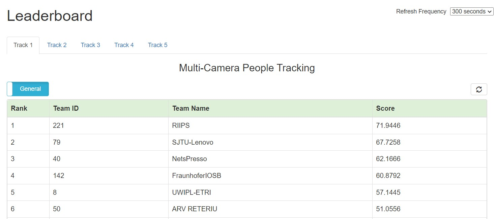

# CVPRW2024: Overlap Suppression Clustering for Offline Multi-Camera People Tracking

The highest HOTA submission in the 8th NVIDIA AI City Challenge (2024) Track 1: Multi-Camera People Tracking. This submission placed 2nd place in the competition due to its offline tracking algorithm.  
[[Arxiv]](https://arxiv.org/pdf/2404.xxxxx.pdf) (Note: The link will be updated once it's published.)

## Dataset Availability

The official dataset can be downloaded from the AI City Challenge website (https://www.aicitychallenge.org/2024-data-and-evaluation/). You need to fill out the dataset request form to obtain the password to download them.

Referring to the DATASET LICENSE AGREEMENT from the dataset author(s), we are not allowed to share the dataset. 
```
2.c. ... you may not copy, sell, rent, sublicense, transfer or distribute the DATASET, or share with others.  
```

 
## Ranking 



## Overall Pipeline


## Environment Requirements

The implementation of our work is built upon [BoT-SORT](https://github.com/NirAharon/BoT-SORT), [OpenMMLab](https://github.com/open-mmlab), and [torchreid](https://github.com/KaiyangZhou/deep-person-reid).

Three different environments are required for the reproduction process. Please install these three environments according to the following repos:
<a name="install"></a>
1. [Install BoT-SORT for people detection](https://github.com/NirAharon/BoT-SORT#installation)
2. [Install torchreid for feature extraction](https://github.com/KaiyangZhou/deep-person-reid#installation)
3. [Install mmpose for pose estimation](https://mmpose.readthedocs.io/en/latest/installation.html) (*Please note that you need to have a version in the 0.x series for this to work.)

We will provide you with the installation command for mmpose v0.29.0.
Please note that this command may change due to updates or modifications in mmpose.
```
#step 1
conda create --name openmmlab python=3.8 -y
conda activate openmmlab

#step 2
conda install pytorch torchvision -c pytorch

#step 3
pip install -U openmim
mim install mmengine
mim install "mmcv==1.7.0"

mim install "mmdet==2.28.2"

#Build mmpose from source
git clone https://github.com/open-mmlab/mmpose.git -b v0.29.0 --depth 1
cd mmpose
pip install -r requirements.txt
pip install -v -e .
```
If you receive an mmcv AssertionError, please reinstall mmcv.
```
mim uninstall mmcv
mim install "mmcv==1.7.0"
```
Once you installed above to the same machine, you'll see the root folder organized as follows:
```
root
│  README.md
│  ranking.jpg
│  overall-pipeline.png
│
├─assets
├─detector
├─embedder
├─poser
├─scripts
├─tools
├─tracking
│
├─BoT-SORT
├─deep-person-reid
└─mmpose
```

## Training 
This project executes
1) Person detection
2) Feature extraction of each person
3) Pose estimation of each person,

However we'll utilize pre-trained models for those. Therefore there's nothing to train.

## Running Tracking

### Preparation
#### 0. Place your video files.

Place your video files to under directory that corresponds to scene/camera IDs, such as Original/<scene_nnn>/<camera_nnnn>/video.mp4.

For example, you'd need to place camera-361 of scene-41 video file, run commands like below. Please don't forget to place whole video files of the scene you'd want to process.
```
mkdir -p Original/scene_041/camera_0361
cp <scene41_camera361_video_file> Original/scene_041/camera_0361/video.mp4
```

#### 1. Frame Extraction

Run a command below to extract frame images.
```
sh scripts/extract_frame.sh 41
```

#### 2. Person Detection

Run steps below for person detection.
- Install BoT-SORT as instracted in Environment Requirement section above [here](#install).
- Prepare Models. Download the pretrained YOLOX_x model from [ByteTrack [Google Drive]](https://drive.google.com/file/d/1P4mY0Yyd3PPTybgZkjMYhFri88nTmJX5/view), and store it to BoT-SORT directory.
- Run person detection by executing a command below.
```
sh scripts/detection.sh 41
```

#### 3. Feature extraction

Run steps below to get feature extraction.
- Install deep-person-reid as instracted in Environment Requirement section above [here](#install).
- Prepare Models. Download the pretrained deep-person-reid model from [torchreid](https://kaiyangzhou.github.io/deep-person-reid/MODEL_ZOO). By running a script mentioned below will donwload this pretrained model automatically and will store it accordingly.
- Run feature extraction by executing a command below.
```
sh scripts/embedding.sh 41
```

#### 4. Pose estimation (To be confirmed and updated)

Run steps below to get pose estimation.
- Install mmpose as instracted in Environment Requirement section above [here](#install).
- Run pose estimation by executing a command below.
```
sh scripts/pose.sh 41
```

### Single Camera People Tracking and Multi Camera People Tracking

#### 5. Both Single Camera People Tracking and Multi Camera People Tracking

Run command steps below to run both Single Camera People Tracking and Multi Camera People Tracking at once.
```
python3 -m venv .venv
source .venv/bin/activate
pip install -r tracking/requirements.txt
sh scripts/tracking.sh 41
```

#### 6. Combine tracking results of each scenes for submission.

Run command below to combine all results of each scenes. This will generate track1.txt under "Submission" directory.
```
python3 tools/generate_submission.py
```
